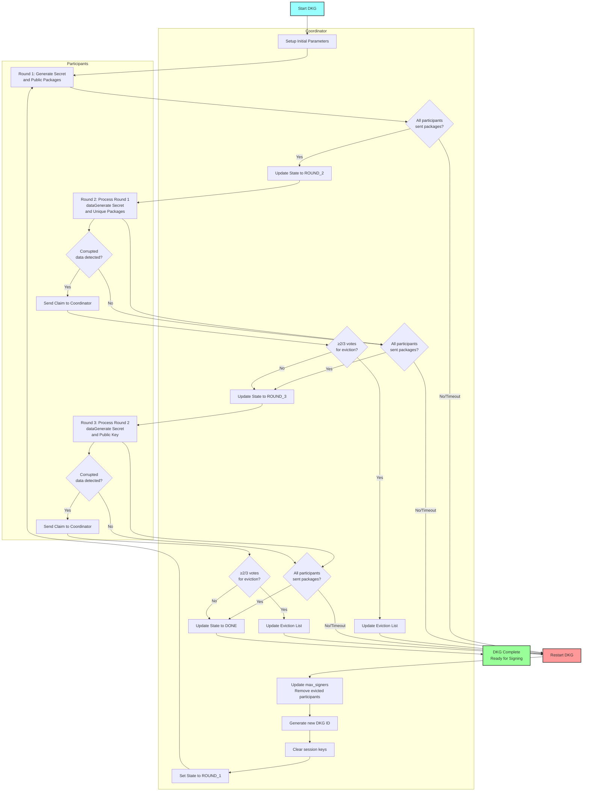
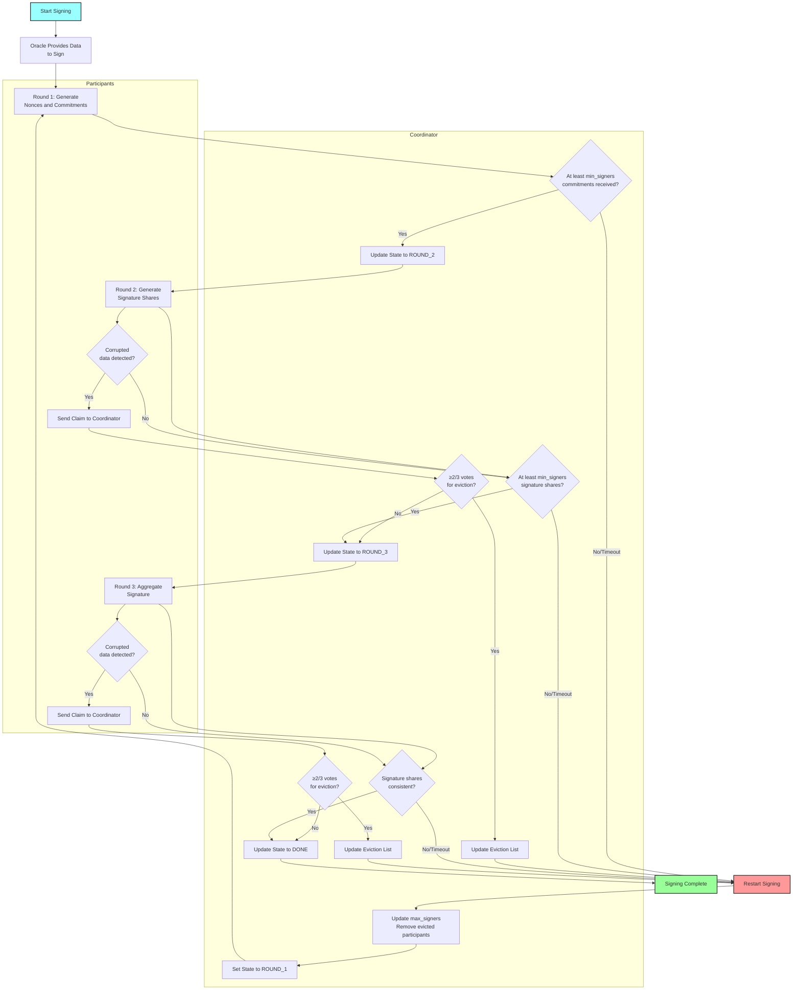
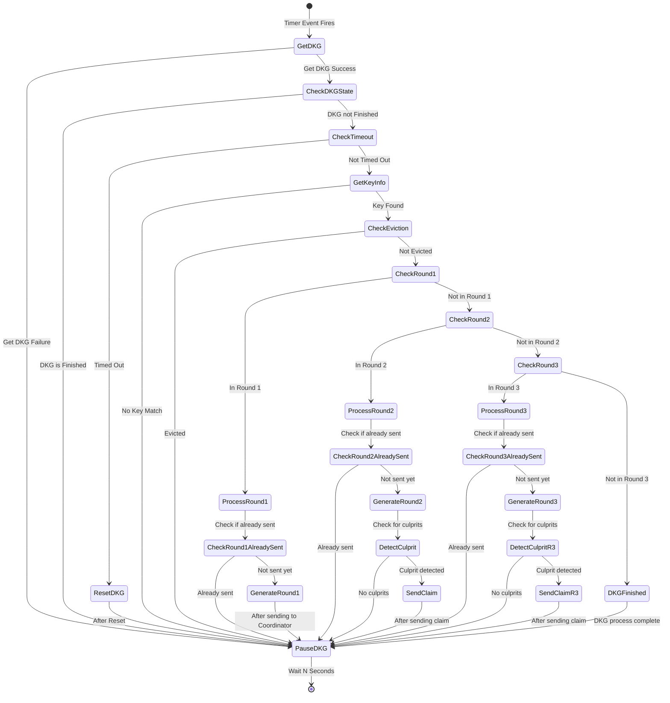

# ORACLE and COORDINATOR

## 1. Introduction & Overview

This document describes a critical component of a cross-blockchain bridge system connecting TON and Bitcoin blockchains. The system enables secure transaction signing between blockchains through two core processes:

1. **Distributed Key Generation (DKG)**: Creates cryptographic keys distributed across multiple parties with no single entity holding the complete key.
2. **Distributed Transaction Signing**: Enables secure signing of Bitcoin transactions (pegouts) using the distributed key.

The system architecture follows a distributed design with multiple Oracle instances coordinated by a central smart contract Coordinator. These Oracles work alongside TON Validators, with new distributed keys generated whenever the Validator set changes.

Key characteristics:
- Supports both standalone (test) and production operational modes
- DKG and Signing processes operate independently
- New DKG processes can run concurrently with ongoing Signing operations

This document focuses exclusively on the DKG and Signing components of the bridge system.

## 2. System Components

The distributed system consists of three primary components:

### 2.1 Oracle Instances

Oracles are the core operational units that:
- Execute both DKG and transaction signing processes
- Store cryptographic keys and signing-related data
- Run independently but coordinate through the central smart contract
- Operate in either standalone mode (with keys from configuration) or production mode (integrated with Validators)

Each Oracle maintains its own configuration, including unique identifiers, keypairs for signing, and other instance-specific parameters.

### 2.2 Validators

TON blockchain validators that:
- Provide signature services to Oracle instances in production mode

### 2.3 Coordinator

A smart contract acting as the central coordination point that:
- Stores and manages data for both DKG and Signing processes
- Processes and validates messages from Oracle instances
- Ensures consistent system state across all participants

The Coordinator enables secure coordination without requiring direct trust between Oracle instances.

## 3. Algorithms

This section describes algorithms of DKG and Signing without implementation details. Implementation will be described in section 4.
FROST (Flexible Round-Optimized Schnorr Threshold Signatures) is a threshold signature scheme that enables a group of signers to collaboratively produce a single Schnorr signature.

### 3.1. Distributed Key Generation (DKG)

The Distributed Key Generation protocol enables participants to collectively generate a single public key while having each participant hold only a share of the corresponding private key. No single participant (or fewer than the threshold) can reconstruct the full private key. This is description of abstract algorithm, implementation will be described below in separate paragraph. Here we have Participants and Coordinator. Participants are independent actors who generate and store part of the key. Coordinator used as storage of DKG global state and point of data exchange.

To generate distributed key we need to go through next steps:

**Step 1. Setup initial parameters for DKG:**
1.1. Number of participants (max_signers): Total number of participants in the signing group.
1.2. Threshold value (min_signers): Minimum number of participants required to create a valid signature (t ≤ n).
1.3. Time period for DKG. If DKG is not finished in this period, then all process needs to be restarted from the beginning. 
1.4. List of participants. Each participant have unique ID.
1.5. List of participants who was evicted from DKG process (they don`t send all necessary data in Time period or they send corrupted data).
1.6. Unique ID for DKG. In our implementation we use unix timestamp of DKG period end. 
1.7. Public key associated with participant ID. On each step every message is signed with private key of the participant and verified by Coordinator (storage of share data). Participants trust the Coordinator and do not execute additional verification. Additionally Coordinator checks that participant was not evicted from DKG. If participant message has incorrect signature or participant was evicted, then message from such participant is ignored. On all steps the Coordinator verify only signature, eviction list, DKG step and timeout. So every participant can send only one variant of data. We have additional voting mechanism for participants eviction.
1.8. Current DKG state. At the beginning state is ROUND_1.
1.9. List of participants session keys. Those keys will be used for message signing in the Signing process instead of the public keys from List of participants. At the beginning this list is empty.
 
**Step 2 (Round 1)**
Each participant generates Secret and Public packages. Round 1 Secret participants keeps locally in secure, while public packages need to be published (all packages sends to the Coordinator). When all participants published their Round 1 Public packages then round is considered complete. We go to the Round 2. If not all participants (< max_signers) sent their data until DKG timeout, then we go to Restarting DKG step. We do not vote for eviction at this step, only DKG timeout can happen.
Coordinator decides when Round 1 is finished. State updated to the ROUND_2.

**Step 3 (Round 2)**
Each participant gets: Round 1 public packages from all other participants, Round 1 secret. Then generate Round 2 Secret and set of unique packages (one for every other participants). Round 2 Secret participants keeps locally in secure, while public packages need to be published (all packages for all participants sends to the Coordinator). When all participants published their Round 2 Public packages then round is considered complete. We go to the Round 3.  If not all participants (< max_signers) sent their data until DKG timeout, then we go to Restarting DKG step. Additionally we check data packages on participants side. If we found some corrupted data (wrong number of commitments or just junk data) then we sent special `claim` message to the Coordinator were we set ID of `culprit` participant. When Coordinator detects that at least 2/3 of current participants voted for eviction of some participant then list of evicted participants updated (add `culprit` participant) and DKG process need to be restarted.
Coordinator decides when Round 2 is finished. State updated to the ROUND_3.

**Step 4 (Round 3)**
Each participant collects their Round 2 public packages from all other participants. Then get those packages, Round 2 secret and generate Round 3 Secret and Public Key. This Public Key must be the same for all participants. Round 3 Secret participants keeps locally in secure, while public key package need to be published (all packages sends to the Coordinator). If not all participants (< max_signers) sent their data until DKG timeout, then we go to Restarting DKG step. Additionally we check data packages on participants side. If we found some corrupted data (wrong secret share) then we sent special `claim` message to the Coordinator were we set ID of `culprit` participant. When Coordinator detects that at least 2/3 of current participants voted for eviction of some participant then list of evicted participants updated (add `culprit` participant) and DKG process need to be restarted.
Coordinator decides when Round 3 is finished. State updated to the DONE.

**Restarting DKG**
If DKG is restarting:
1. Number of participants (max_signers): value updated with respect to List of participants who was evicted. So new max_signers can be smaller than previous.
2. Threshold value (min_signers): keeps the same.
3. Time period for DKG. Keeps the same
4. List of participants. From this list we removes participants who was evicted.
5. List of participants who was evicted remains the same.
6. Unique ID for DKG. Sets new value = current timestamp + Time period for DKG. 
7. Public key associated with participant ID. Keeps the same.
8. Current DKG state. State is ROUND_1.
9. List of participants session keys. This list is cleared and make empty.

When DKG state is DONE then we can use it for signing transactions. Each participant stores their part of key, Coordinator contains public key.

**DKG Flow**

### 3.2. Distributed Transaction Signing

The FROST (Flexible Round-Optimized Schnorr Threshold Signatures) Distributed Transaction Signing protocol enables a threshold number of participants to collaboratively sign a transaction using their key shares generated during the Distributed Key Generation (DKG) process.

To sign a transaction using distributed key shares, we need to go through the following steps:

We assume that:
1. There are some data to sign.
2. DKG process is DONE with N participants.
3. Oracle contains session public keys for each participant.
4. min_signers <= N.
5. Oracle contains DKG public key.
6. Participants contain separated secret parts for signing.
7. For each data to sign there is a Time period. If Signing is not finished in this period, then the entire Signing process needs to be restarted from the beginning (DKG stays the same).
8. Current Signing state = ROUND_1.

Logic of Rounds are the same as in DKG process. Participants do some calculations and send signed messages to the Coordinator.

To sign a transaction using distributed key shares, we need to go through the following steps:

**Step 1.**
Oracle gives to the participants (we trust the Oracle) the same data to sign.

**Step 2 (Round 1). Commitment Generation**
Each participant generates Nonces and Commitment packages. Round 1 Nonces participants keeps locally, while Commitment packages need to be published (all packages sends to the Coordinator). When min_signers participants published their Round 1 Commitments then round is considered complete. All participants that do not send their Commitments will be ignored in next steps. We go to the Round 2. We do not vote for eviction at this step, only timeout can happen.
Coordinator decides when Round 1 is finished. State updated to the ROUND_2.

**Step 3 (Round 2). Signature Share Generation**
Each participant gets: Round 1 Commitment packages from all other participants, Round 1 Nonce, Secret package from DKG Round 3, hash of the data to sign (and in implementation of the Oracle additionally we use tap merkle root as tweak for tweaking signing share). Then generate Round 2 Sign Share. Round 2 Sign Share need to be published (all packages sends to the Coordinator). When all participants (min_signers) published their Round 2 Sign Share packages then round is considered complete. We go to the Round 3. If not all participants (< min_signers) sent their data until Signing timeout, then we go to Restarting Signing step. Additionally we check data packages on participants side. If we found some corrupted data then we sent special `claim` message to the Coordinator (the same algorithm as in DKG) and Signing process need to be restarted.
Coordinator decides when Round 2 is finished. State updated to the ROUND_3.

**Step 4 (Round 3). Signature Aggregation**
Each participant gets: Signing Shares from other participants, commitment packages, public key and tap tweak. From this data with FROST we aggregate signature and send it to the Oracle. Signature must be the same for all participants. If not all participants (< min_signers) sent their data until Signing timeout, then we go to Restarting Signing step. Additionally we check data packages on participants side. If we found some corrupted data then we sent special claim message to the Coordinator (the same algorithm as in DKG) and Signing process need to be restarted.
Coordinator decides when Round 3 is finished. State updated to the DONE.

**Restarting Signing**
When Signing is restarting:
1. Number of participants (max_signers): value updated with respect to List of participants who was evicted.
2. Threshold value (min_signers): keeps the same.
3. Time period for Signing. Keeps the same
4. List of participants. From this list we removes participants who was evicted.
5. List of participants who was evicted remains the same.
6. Current Signing state. State is ROUND_1.

When signing is complete, the signature is returned along with the transaction data. The signature can be verified by anyone using the group public key generated during the DKG process.

**Transaction Signing Flow**

## 4. Implementation of the DKG and Signing

This section describes the practical implementation of the Distributed Key Generation (DKG) and Transaction Signing processes using the FROST library for Bitcoin transactions.
The Coordinator serves as the central place for both the DKG and Signing processes, managing global state, communication between participants. The implementation uses the secp256k1 elliptic curve, which is the same curve used in Bitcoin's cryptographic operations.

### 4.1 DKG Data Structures

The DKG process utilizes a hierarchical data structure that tracks the state and components of the distributed key generation protocol:

#### Main DKG Structure
- **State**: Tracks the current phase of the DKG process (Finished, InProgress, Part1Finished, or Part2Finished)
- **VSet**: Set of validators participating in the DKG process, mapped by ValidatorID [0..99] which is the same ID used for OracleID. Each element contains the public key of the participant (validator key in case of production mode and oracle hard-coded key in standalone mode)
- **MaxSigners**: Maximum number of signers allowed in the process. The Minimum number of Signers is calculated as 2/3 of the maximum number of signers.
- **VSetMask**: Bit mask indicating which validators are active in the DKG process. In this mask, each bit position corresponds to the OracleID (e.g., bit position 5 represents Oracle with ID 5). There is a "claim" process which allows Oracles to vote for another oracle's eviction from DKG in case of malicious actions. Additionally, in case of timeouts, the Coordinator can automatically evict Oracles from the DKG process.
- **SessionKeys**: Public keys generated by validators during the final part of DKG (Round 3) and used to sign messages for the Coordinator during the Signing process. These should not be confused with the FROST distributed key that signs the actual pegout transactions.
- **Round Data**: Structures for each of the three DKG rounds (R1, R2, R3)
  - **Round 1 Data**: 
    - **Mask**: Bit mask tracking which validators have submitted their R1 data
    - **Count**: Number of submissions received for Round 1
    - **Packages**: Collection of cryptographic packages from each participant mapped by validator ID. These are FROST-specific packages containing commitment data.
  
  - **Round 2 Data**:
    - **Mask**: Bit mask tracking which validators have submitted their R2 data
    - **Count**: Number of submissions received for Round 2
    - **PackagesTo**: Two-level mapping of packages from sender to recipient validators (PackagesTo[FromId][ToId]). These are FROST-specific packages where each Oracle generates a unique package for every other Oracle.
  
  - **Round 3 Data**:
    - **Mask**: Bit mask tracking which validators have submitted their R3 data
    - **Count**: Number of submissions received for Round 3
    - **PubkeyData**: Contains the distributed public key package and internal key data for verification. These are FROST-specific packages.
- **Claims**: Data about validator claims during the DKG process. It contains:
  - **Mask**: Bit mask indicating Oracles who have submitted claims
  - **Count**: Total number of claims received
  - **Counters**: Mapping of Oracle IDs to their respective claim counts
- **Configuration Hash**: Hash of the system configuration
- **Attempts**: Counter for the number of DKG attempts made
- **Until**: Timestamp indicating when the DKG process must complete. If the DKG is not completed before this timestamp, the Coordinator will not accept any DKG messages except those restarting the DKG process

### 4.2 Signing Data Structures

The Signing process uses data structures that connect to artifacts produced during the DKG process. The primary connection is the secret from DKG Round 3, which is stored as a file in the `secrets` folder, with the filename matching the DKG public key.

The core data structure for the signing process is the `PegoutRecord`, which tracks all information related to a transaction waiting to be signed:

- **ID**: Unique identifier for the pegout record
- **PegoutAddress**: TON blockchain address information, which includes:
  - **Address Type**: Can be NoneAddress (0), ExtAddress (1), StdAddress (2), or VarAddress (3)
  - **Workchain**: The TON blockchain workchain ID (with Masterchain having a special value of -1)
  - **Flags**: Configuration flags (bounceable, testnet)
  - **Bit Length**: Size of the address data in bits
  - **Address Data**: The actual address data as a byte array

- **InternalKey**: Internal key data required for signing
- **Commitments**: Mapping of Oracle IDs to their FROST commitments for this pegout
- **CommitmentsMask**: Byte array tracking which Oracles have submitted commitments
- **SigningShares**: Two-level mapping of signing shares from sender Oracles to recipient Oracles
- **SigningSharesMask**: Byte array tracking which Oracles have submitted signing shares
- **Signatures**: Structure containing the completed signature data:
  - **Mask**: Bit mask of Oracles who contributed to the signature
  - **Count**: Number of signature components
  - **Hash**: Hash of the signature data
- **ClaimsMask**: Bit mask indicating which Oracles have submitted claims
- **ClaimsCount**: Total number of claims received
- **ClaimsCounters**: Mapping of Oracle IDs to their respective claim counts
- **MaxSigners**: Maximum number of signers allowed for this pegout
- **ExpiredAt**: Timestamp indicating when this pegout record expires
- **SigningMask**: Bit mask indicating which Oracles are participating in signing

### 4.3 System Workflows

Oracle instances operate in a stateless manner, with periodic timer events triggering the beginning of processes. Each time an event fires, the Oracle goes through all steps from the beginning of the workflow.

The system supports two operational modes:

**Standalone Mode**:
- Designed for test environments
- Uses "hardcoded" keys in the configuration for message signing
- Coordinator contract must be deployed with pre-configured VSet for specific Oracles and their associated keys
- No Validator is required in this mode

**Production Mode**:
- Designed for production environments
- Oracle must have access to validator-console to make signing requests
- Coordinator contract must be deployed with production settings
- VSet in this mode is obtained from config 36

**NOTE**: Every message in the DKG process includes an Oracle signature - obtained through validator-console in production mode or using the hardcoded key in standalone mode.

### 4.4 DKG Process

The goal of the DKG process is to generate a cryptographic key distributed across all participating Oracles. No single Oracle has access to the complete key.

**Step 1: Get DKG Data from Coordinator**
- A timer event fires every N seconds
- Oracle calls the `get_dkg` method from the Coordinator (getter)
- On success: Coordinator returns the current DKG structure
- On failure: Oracle pauses the DKG process for N seconds

**Step 2: Check if DKG is Complete**
- If DKG state is `DKGStateFinished`, then the DKG process is done
- Oracle will pause DKG for N seconds
- If DKG is not finished, proceed to Step 3

**Step 3: Check DKG Timeout**
- Verify that the DKG has not timed out by checking that the `until` value is after the current timestamp
- If DKG is not timed out, proceed to Step 4
- If DKG is timed out, Oracle resets its DKG state:
  - Generate new Session key and save it to a file (filename matches the `until` value)
  - Clean all artifacts
  - Save Coordinator's `until` DKG value to the Oracle's `until` DKG value
  - Pause DKG for N seconds

**Step 4: Get Key Information**
- Iterate over all VSet records to find a match with the public keys Oracle has
  - In production mode: Validator key
  - In standalone mode: Key hardcoded in config
- If no match is found, pause DKG for N seconds
- If match is found, continue to Step 5

**Step 5: Check for Eviction**
- Check VSetMask to determine if the Oracle has been evicted
- If Oracle is evicted, pause DKG for N seconds
- If Oracle is not evicted, continue to Step 6
Eviction status is checked on the Coordinator side. On the Oracle side, this check is only used for logging and timeout cases.

**Step 6: DKG Round 1**
 We assume that DKG initial state setup as described in 3.1. Distributed Key Generation (DKG).

- Check if DKG is at Round 1 state (`DKGStateInProgress`)
  - If not, proceed to Step 7 (DKG Round 2)
- Check if Oracle already sent DKG Round 1 package and is waiting for others:
  - Check in Coordinator's DKG data
  - Check in local artifacts (in case transaction was sent but not yet processed)
  - If already sent, pause DKG for N seconds
- If not already sent:
  - Generate new Round 1 data (commitment and secret share) as described in 3.1. Distributed Key Generation (DKG).
  - Save secret share to Oracle artifacts
  - Send commitment to Coordinator (OpCode: `0x0000eaea`)
  - Pause DKG for N seconds

**Step 7: DKG Round 2**
- Check if DKG is at Round 2 state (`DKGStatePart1Finished`)
  - If not, proceed to Step 8 (DKG Round 3)
- Check if Oracle already sent DKG Round 2 packages and is waiting for others
  - If already sent, pause DKG for N seconds
- If not already sent:
  - Generate new Round 2 data (individual shares for each other Oracle) as described in 3.1. Distributed Key Generation (DKG).
  - Save secret to Oracle artifacts
  - Send Round 2 packages to Coordinator (OpCode: `0x0000bb50`)
  - Pause DKG for N seconds

**NOTE**: In Round 2, FROST may detect a "culprit" Oracle that sent corrupted Round 1 package. FROST can detect one culprit at a time. If a culprit is detected, Oracle sends a claim message to the Coordinator (OpCode: `0x0000f387`). If at least 2/3 of DKG participants claim an Oracle, it will be evicted from this DKG round and the DKG must be restarted.

**Step 8: DKG Round 3**
- Check if DKG is at Round 3 state (`DKGStatePart2Finished`)
  - If not, proceed to Step 9 (DKG Finished)
- Check if Oracle already sent DKG Round 3 packages and is waiting for others
  - If already sent, pause DKG for N seconds
- If not already sent:
  - Generate new Round 3 data (Key package, public key package) as described in 3.1. Distributed Key Generation (DKG).
  - Save key package to Oracle keystore
  - Send Round 3 public key to Coordinator
  - Pause DKG for N seconds

**NOTE**: Similar to Round 2, FROST may detect a "culprit" Oracle that sent corrupted Round 2 packages. If a culprit is detected, Oracle sends a claim message to the Coordinator. If at least 2/3 of DKG participants claim an Oracle, it will be evicted and DKG must be restarted.

**Step 9: DKG Finished**
- After completing all rounds, the Coordinator's DKG data contains:
  - The distributed public key
  - The set of Oracles who can participate in pegout signing

**DKG Process State Diagram**

The following diagram illustrates the state transitions in the DKG process:

### 4.5 Signing Process

... Work in progress...

### 4.6 Coordinator

... Work in progress...