# TON Teleport BTC Signing Protocol Specification

## 1. Introduction & Overview

This document specifies the protocol for signing Bitcoin transactions within the TON Teleport BTC system (**System**). The signers are TON validators (**Validators**) that run specialized software modules called **Oracles**.

In the production environment, each **Oracle** is an integral part of a **Validator** in the masterchain. The number of **Oracles** precisely matches the number of **Validators** in the TON network, establishing a one-to-one correspondence. While a standalone mode exists for testing purposes (allowing **Oracles** to operate independently of validator nodes), this document focuses exclusively on the production configuration.

The protocol implements two core processes:

1. **Distributed Key Generation (DKG)**: A process where a group of `n` **Oracles** collectively generate a single Bitcoin public key while each **Oracle** holds only a partial share of the corresponding private key. No individual **Oracle** or subset smaller than a defined threshold `t` can reconstruct the complete private key.

2. **Transaction Signing (Signing)**: A process allowing a threshold subset of **Oracles** (at least `t` out of `n`) to collaboratively sign Bitcoin transactions (pegouts) using their key shares without revealing their individual private key fragments.

Both processes are implemented using Flexible Round-Optimized Schnorr Threshold Signatures (**FROST**)[^1], producing standard Bitcoin-compatible Schnorr signatures.

The **System** employs a distributed architecture with multiple **Oracle** instances coordinated by a central smart contract called the **Coordinator**. The **Coordinator** stores and manages the global state for both **DKG** and **Signing** processes, validates messages from **Oracle** instances, and ensures consistency across all participants without requiring direct trust between **Oracles**. The protocol automatically regenerates distributed keys whenever the **Validator** set changes, ensuring continuous operation of the **System**.

## 2. Key Protocol Components

This section describes the core entities involved in the signing protocol and their specific roles in enabling Bitcoin transaction signing.

### 2.1 Oracle Instances

**Oracles** are the specialized software modules that:

- Participate in the **DKG** process to collectively generate a public key (**InternalKey**) while each **Oracle** holds only a partial share of the private key (**SecretShare**)
- Use their **Secrets** in the **Signing** process to contribute partial signatures that are aggregated into one complete Bitcoin signature
- Store secret data locally for both **DKG** and **Signing** rounds (secret shares, nonces, etc.)
- Communicate with other **Oracles** indirectly via the **Coordinator**
- Retrieve **DKG** and **Signing** session data and state from the **Coordinator**
- Run as part of **Validators**
- Request signatures from their associated **Validator** (using the validator's keys for the current epoch)

Each **Oracle** maintains security-critical information locally, including private key shares that are never shared with other components.

### 2.2 Validators

**Validators** in the TON blockchain:

- Host and operate **Oracle** instances in production mode
- Provide signature services (using their validator keys) to their associated **Oracle** instances
- Form a decentralized trust base for the entire **System**

The one-to-one relationship between **Validators** and **Oracles** ensures that validator consensus rules extend to the **Signing** protocol.

### 2.3 Coordinator

The **Coordinator** is a smart contract that:

- Acts as the single source of truth for the protocol state
- Stores and manages the **DKG** and **Signing** data
- Maintains the **VSet** (set of validators/oracles participating in the protocol)
- Verifies that messages from **Oracle** instances are properly signed, confirming they came from legitimate TON **Validators** and not random sources
- Stores the **InternalKey** and session keys
- Enforces timeouts for **DKG** and **Signing** processes
- Manages claims against malicious behavior and eviction voting
- Initiates new **DKG** rounds when validator set changes occur

The **Coordinator** is deployed on the TON blockchain and does not require trust in individual **Oracle** instances, relying instead on cryptographic validation and consensus rules.

## 3. Core Protocol Algorithms

This section describes the abstract algorithms behind the **DKG** and **Signing** processes that form the cryptographic foundation of the **System**. The concrete implementation details are covered separately in Section 4.

### 3.1. DKG

The **DKG** process allows a group of **Oracles** to collaboratively generate an **InternalKey** while each **Oracle** maintains only a share (**SecretShare**) of the corresponding private key. No individual **Oracle** or any group smaller than the threshold `t` can reconstruct the complete private key.

In this process, **Oracles** act as independent participants that generate and securely store their portions of the key material. The **Coordinator** serves as the central storage for the global state of the **DKG** process and facilitates secure data exchange between participants without revealing their **Secrets**.

> **Note**: For more detailed information about the underlying cryptographic mechanisms of FROST DKG, see the [FROST DKG Tutorial](https://frost.zfnd.org/tutorial/dkg.html).

#### Initial Parameters Setup

The **DKG** process begins by configuring the following parameters that define how the distributed key will be generated and later used for transaction signing:

1. **Max Signers**: Total number of **Oracle** participants that will collectively generate the **InternalKey** and hold shares of the private key.
2. **Min Signers**: Threshold value `t` of **Oracles** required to later collaborate in creating valid signatures. This ensures that no smaller group can forge signatures (where `t ≤ n`).
3. **DKG timeout**: Maximum duration allowed for the **DKG** process to complete. If exceeded, the process restarts.
4. **Participant list**: Registry of all participating **Oracles** with unique IDs.
5. **Eviction list**: **Oracles** removed from the **DKG** process due to timeouts or submission of corrupted data.
6. **DKG ID**: Unique identifier for this specific **DKG** session (implementation uses the UNIX timestamp of the session end period).
7. **Participant keys**: Public keys of each **Oracle**, used to sign and verify all protocol messages during both **DKG** and subsequent **Signing** processes.
8. **DKG State**: Current step of the process, initially set to `R1`.
9. **Session keys list**: Special-purpose keys generated during **DKG** that will be used for message signing in the later **Signing** process. Initially empty.

All messages in the **DKG** process must be cryptographically signed before being sent to the **Coordinator**. In the implementation, each **Oracle** requests its associated **Validator** to sign every message with the validator's key for the current epoch. The **Coordinator** verifies these signatures, rejects messages without valid **Validator** signatures, checks that the **Oracle** hasn't been evicted, and enforces timeouts.

#### DKG Round 1

In this initial round, each **Oracle**:

1. Generates both a secret package (`sR1-o{i}`) and a public package (`pR1-o{i}`) using the specified **Max Signers** and **Min Signers** threshold parameters, where `{i}` represents the **Oracle's ID** (e.g., `sR1-o1` for **Oracle 1**, `pR1-o2` for **Oracle 2**, etc.)
2. Keeps the secret package (`sR1-o{i}`) secure in local storage
3. Sends the public package (`pR1-o{i}`) to the **Coordinator**

The round progresses as follows:

- The **Coordinator** collects `pR1-o{i}` from all **Oracles**
- When all **Oracles** have published their packages, the round is considered complete
- If any **Oracle** fails to submit data before the **DKG timeout**, the process moves to the **Restart** procedure (described in the [DKG Restart Procedure](#dkg-restart-procedure) section)
- No eviction voting (**Eviction**) occurs during this round; only timeout-based evictions are possible
- Once all required data is collected, the **Coordinator** updates the state to `R2`

**Round 1 Process**:

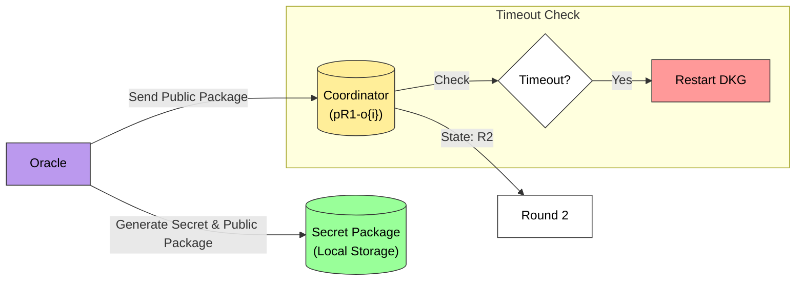

#### DKG Round 2

In this round, each **Oracle** (for example with **ID 1**):

1. Retrieves `pR1-o{i}` of all other participants from the **Coordinator**
2. Generates a Round 2 secret package (`sR2-o{i}`) and set of public packages packages (`pR2-o{1}-o{i}`), one targeted for each other **Oracle** using `sR1-o{1}` along with others' public packages
3. Stores `sR2-o{i}` locally
4. Sends all packages `pR2-o{1}-o{i}` to the **Coordinator**

The round progresses as follows:

- The **Coordinator** collects all `pR2-o{i}-o{j}` packages from participating **Oracles** (for example, with 100 **Oracles**, each generates 99 packages for other **Oracles**, resulting in a total of 9,900 packages)
- Each **Oracle** verifies received data and may detect corrupted packages
- If corrupted data is detected, the **Oracle** sends a `claim` message to the **Coordinator** identifying the malicious participant
- When at least 2/3 of active participants vote to evict an **Oracle**, the **Coordinator**:
  1. Adds the malicious **Oracle** to the **Eviction list**
  2. Moves to the **Restart** procedure (described in the [DKG Restart Procedure](#dkg-restart-procedure) section)
- If fewer than **Max Signers** send their data before the **DKG timeout**, the process moves to the **Restart** procedure (described in the [DKG Restart Procedure](#dkg-restart-procedure) section)
- Once all required packages are successfully submitted, the **Coordinator** updates the state to `R3`

**Round 2 Process**:

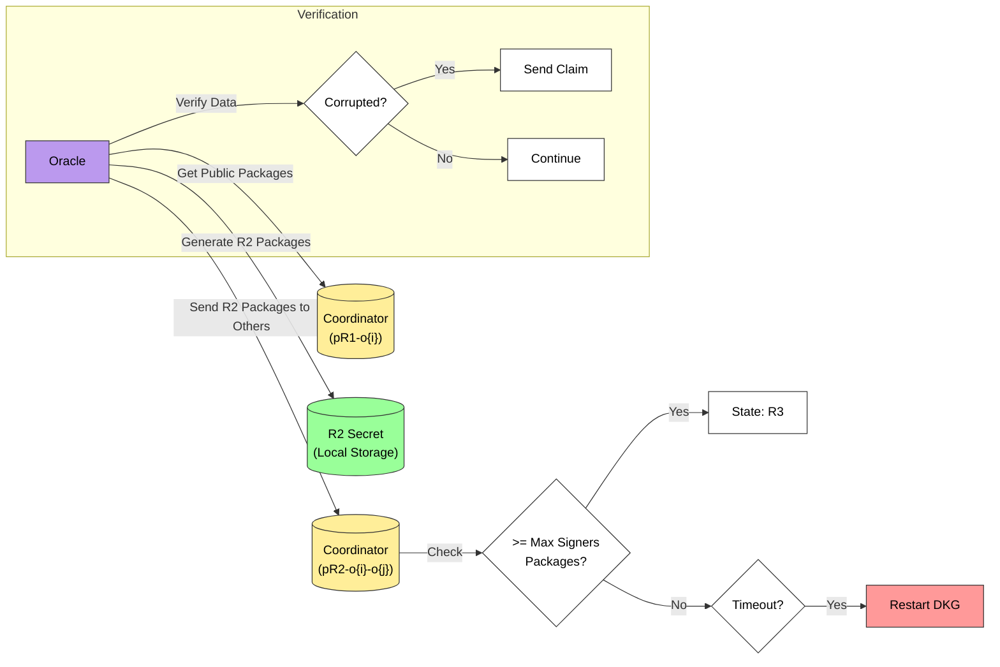

#### DKG Round 3

In this final round, each **Oracle** (for example with **ID 1**):

1. Retrieves all packages `pR2-o{i}-o{1}` targeted to itself from the **Coordinator**
2. Generates its **SecretShare** share (`s-o{1}`) and the **InternalKey** by combining `sR2-o{1}` with the received packages
3. Stores **SecretShare** locally
4. Sends the **InternalKey** and **Verification Data** to the **Coordinator** (details about **Verification Data** are described in the [Session Key Generation](#session-key-generation) section)

The round completes as follows:

- The **Coordinator** verifies that all submitted **InternalKey** values match
- **Oracles** may detect inconsistencies and submit `claim` messages about malicious participants
- When at least 2/3 of active participants vote to evict an **Oracle**, the **Coordinator**:
  1. Adds the malicious **Oracle** to the **Eviction list**
  2. Moves to the **Restart** procedure (described in the [DKG Restart Procedure](#dkg-restart-procedure) section)
- If fewer than **Min Signers** send their data before the **DKG timeout**, the process moves to the **Restart** procedure (described in the [DKG Restart Procedure](#dkg-restart-procedure) section)
- When successful, the **Coordinator** updates the state to `DONE`

**Round 3 Process**:

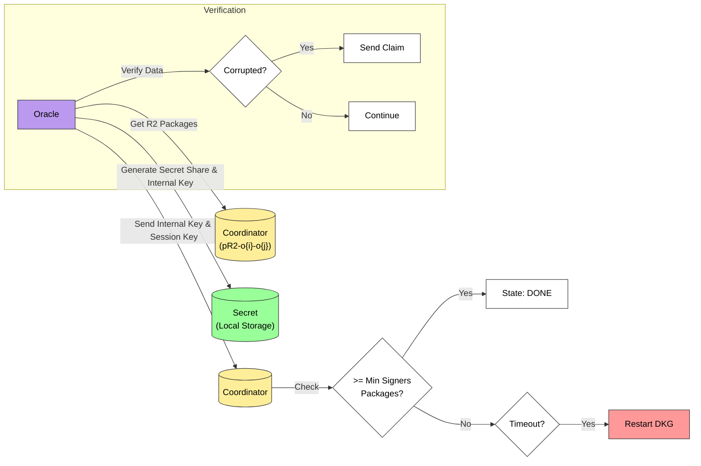

At this point, the distributed key generation is complete. Each **Oracle** holds its unique **SecretShare** (`s-o{i}`), while the **Coordinator** stores the **InternalKey** that will be used to verify signatures.

#### DKG Restart Procedure

When the **DKG** process fails to complete successfully (due to timeouts or evictions), the **Coordinator** initiates the restart procedure with the following parameter updates:

- **Max Signers**: Adjusted to the current number of active **Oracles** (excluding those in the **Eviction list**)
- **Participant list**: Updated by removing all evicted **Oracles**
- **DKG ID**: Regenerated using the formula: current timestamp + **DKG timeout**
- **DKG State**: Reset to `R1`
- **Session keys list**: Fully purged with no entries retained
- All other parameters remain unchanged from the current **DKG** state

After these updates, the **Coordinator** restarts the **DKG** process from [Round 1](#dkg-round-1).

**DKG Restart Process**:

```mermaid
flowchart LR
    Restart(["Restart Triggered"]) --> UpdateSigners["Update Max Signers"]
    UpdateSigners --> UpdateList["Update Participant List"]
    UpdateList --> NewID["Generate New DKG ID"]
    NewID --> ResetState["Reset State to R1"]
    ResetState --> ClearKeys["Clear Session Keys"]
    ClearKeys --> StartR1["Start Round 1"]

    style Restart fill:#f99, stroke:#333, color:#000
    style StartR1 fill:#9ff, stroke:#333, color:#000
    style UpdateSigners fill:#fff, stroke:#333, color:#000
    style UpdateList fill:#fff, stroke:#333, color:#000
    style NewID fill:#fff, stroke:#333, color:#000
    style ResetState fill:#fff, stroke:#333, color:#000
    style ClearKeys fill:#fff, stroke:#333, color:#000
```

#### DKG Final State

When the **DKG** process eventually completes successfully (reaching the `DONE` state), each **Oracle** securely holds its unique **SecretShare** (`s-o{i}`), while the **Coordinator** stores the collective **InternalKey**. At this point, each **Oracle** permanently deletes all intermediate secrets (`sR1-o{i}`, `sR2-o{i}`) from previous rounds, retaining only the final **SecretShare**. This successful completion of the key generation phase prepares the **System** for the subsequent **Signing** process.

#### Session Key Generation

As part of the **DKG** completion, each **Oracle** generates an additional Ed25519 key pair. The **Oracle** securely stores the private key (**SessionSecret**) locally, while sending the public key together with **InternalKey** to the **Coordinator** for storage in the **Session keys list**. This message is signed by the **Validator's** key, allowing the **Coordinator** to verify its authenticity.

These session keys serve an important optimization purpose: they allow the **Oracle** to sign future **Signing** process messages without requiring repeated signature requests to the **Validator** node. In essence, the **Validator** delegates signing authority to this session key for the duration of the epoch, significantly reducing the number of validator signature requests and improving overall security.

#### DKG Flow Overview

The following diagram illustrates the high-level flow of the **DKG** process:

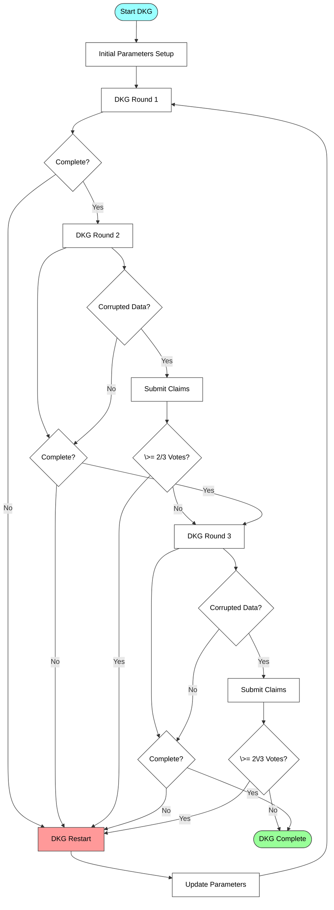

### 3.2. Signing

The **Signing** process enables a threshold number of **Oracles** to collaboratively sign a transaction using **InternalKey** and **SecretShare** generated during the **DKG** process.

> **Note**: For more detailed information about the underlying cryptographic mechanisms of FROST signing, see the [FROST Signing Tutorial](https://frost.zfnd.org/tutorial/signing.html).

In this process, **Oracles** act as signers that use their **SecretShare** shares to contribute to a collective signature without revealing their private key material. The **Coordinator** facilitates the signing by managing the global state and coordinating communication between participants.

#### Prerequisites

1. The DKG process is successfully completed and in the `DONE` state
2. At least **Min Signers** amount of **Oracles** are available to participate in signing (this threshold value is established during the [Initial Parameters Setup](#initial-parameters-setup) phase of the DKG process)
3. Each participating **Oracle** has access to its **SecretShare** from the passed **DKG**
4. The **Coordinator** has all **Session public keys** for each **Oracle**
5. There is **Data** to be signed

The **Signing** process consists of three rounds, similar to the DKG process. If not completed within a defined time period, the entire **Signing** process is restarted from the beginning, while the DKG remains unchanged.

#### System Context and Pegouts

In the **System**, signing requests come from "pegouts" — Bitcoin transactions that transfer funds from the TON ecosystem back to the Bitcoin blockchain. When a pegout is deployed, the transaction **Data** is sent to the **Coordinator** for signing. **Oracles** periodically check the **Coordinator** for pending signing requests and initiate the signing process when new requests are detected.

It's important to note that during a single validation epoch, multiple signing requests can be processed using the same **InternalKey**. The **System** is designed to handle these concurrent requests, with each request being processed independently through the three-round signing process.

This document focuses on the signing protocol itself rather than the specific mechanisms by which pegout **Data** is generated or processed by the **Coordinator**.

#### **Data** Distribution

Before the signing rounds begin, all participating **Oracles** must obtain the same transaction **Data** to sign. Each **Oracle** retrieves the **Data** that needs to be signed from the **Coordinator**, who maintains a queue of pending sign requests.

**Signing Round 1: Commitment Generation**
Each **Oracle**:

1. Generates `nonce` and commitment package (`signR1-o{i}`), where `{i}` represents the **Oracle's ID** (e.g., `sR1-o1` for **Oracle 1**, `signR1-o2` for **Oracle 2**, etc.) using their **SecretShare** share
2. Keeps the `nonce` locally for security
3. Sends `signR1-o{i}` to the **Coordinator**

The round progresses as follows:

- The **Coordinator** collects `signR1-o{i}` from participating **Oracles**
- When at least **Min Signers** amount of **Oracles** have submitted their commitment packages, the round is considered complete
- **Oracles** that do not submit commitments will be ignored in subsequent steps
- No eviction voting occurs during this round; only timeout-based evictions are possible
- Once enough commitments are collected, the **Coordinator** updates the state to `R2`

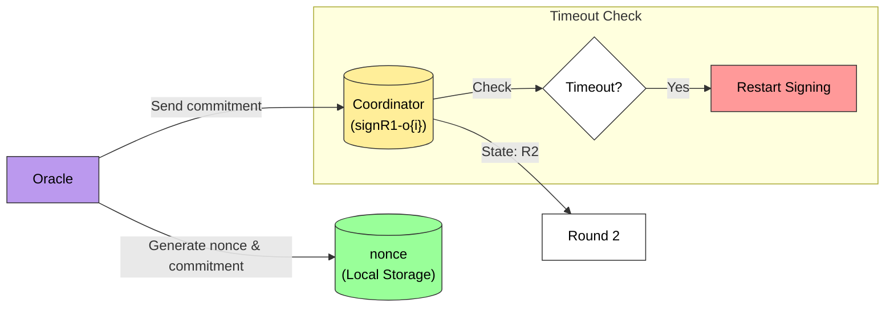

**Signing Round 2: Signature Share Generation**
Each **Oracle**:

1. Retrieves `signR1-o{i}` from all other participants via the **Coordinator**
2. Uses its Round 1 `nonce`, **SecretShare** (`s-o{i}`) share, and the hash of the **Data** to sign
3. Generates a Round 2 signature share (`signR2-o{i}`) and sends it to the **Coordinator**

The round progresses as follows:

- The **Coordinator** collects all `signR1-o{i}` from participating **Oracles**
- When at least **Min Signers** **Oracles** have submitted their `signR2-o{i}`, the round is considered complete
- Each **Oracle** verifies received data and may detect corrupted packages
- If corrupted data is detected, the **Oracle** sends a `claim` message to the **Coordinator** identifying the malicious participant
- When at least 2/3 of active participants vote to evict an **Oracle**, the **Coordinator** adds the malicious **Oracle** to the **Eviction list** and restarts the **Signing** process from the beginning (Step 1)
- If fewer than **Min Signers** **Oracles** send their data before the **Signing timeout**, the process moves to restarting **Signing**
- Once all required signature shares are successfully submitted, the **Coordinator** updates the state to `R3`

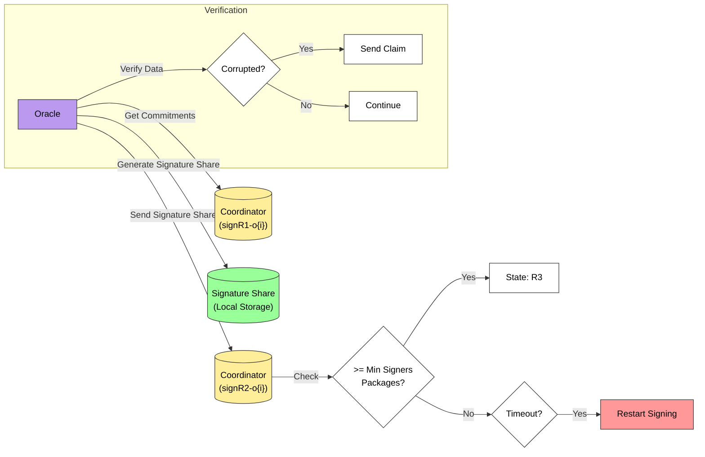

<!-- TODO: We have to check if 2/3 oracles send us same signature -->

**Signing Round 3: Signature Aggregation**
Each **Oracle**:

1. Retrieves `signR2-o{i}` from other **Oracles**, `signR1-o{i}`, **InternalKey**, and the tap tweak via the **Coordinator**
2. Aggregates a complete signature using the **FROST** algorithm
3. Sends the final signature (`sign`) to the **Coordinator**

The round completes as follows:

- The **Coordinator** verifies that all `signR2-o{i}` match
- **Oracles** may detect inconsistencies and submit `claim` messages about malicious participants
- When at least 2/3 of active participants vote to evict an **Oracle**, the **Coordinator** adds the malicious **Oracle** to the **Eviction list** and restarts the **Signing** process
- If fewer than **Min Signers** **Oracles** send their data before the **Signing** timeout, the process restarts
- When successful, the **Coordinator** updates the state to `DONE`

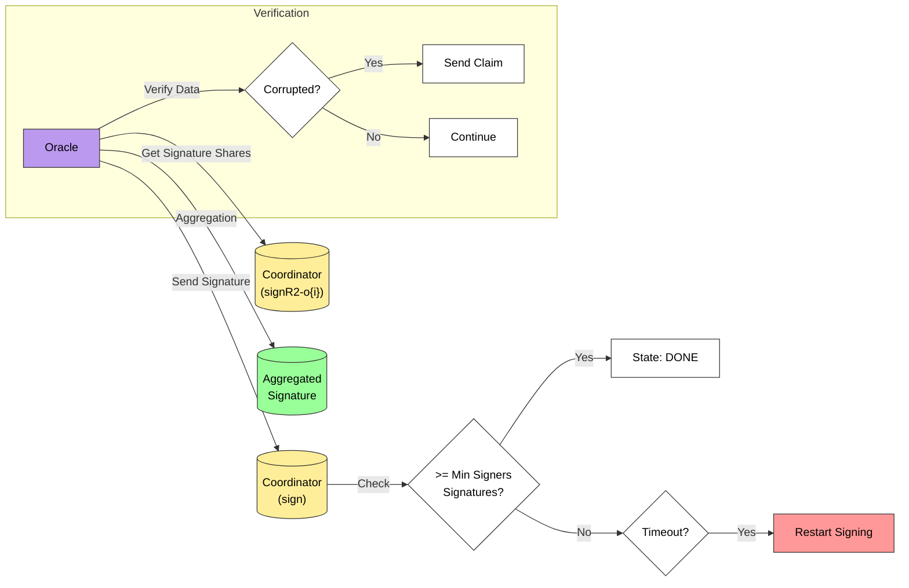

#### Signing Restart Procedure

When the **Signing** process needs to be restarted, the following parameters are updated:

- **Max Signers**: Adjusted to the current number of active **Oracles** (excluding those in the **Eviction list**)
- **Participant list**: Updated by removing all evicted **Oracles**
- **Eviction list**: Preserved from the previous attempt
- **Signing state**: Reset to `R1`
- All other parameters remain unchanged

After these updates, the **Coordinator** restarts the **Signing** process from [**Data Distribution**](#data-distribution).

**Signing Restart Process**:

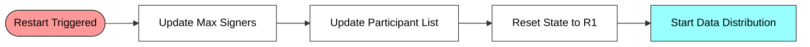

#### Signing Final State

When the **Signing** process completes successfully (reaching the `DONE` state), the **Coordinator** has the valid `sign` for the transaction. This `sign` can be verified by anyone using the **InternalKey** generated during the DKG process. Once a signing request is completed, the **Coordinator** is ready to process the next signing request in the queue, allowing multiple transactions to be processed sequentially during the same validation epoch.

#### Signing Flow Overview

The following diagram illustrates the high-level flow of the **Signing** process:

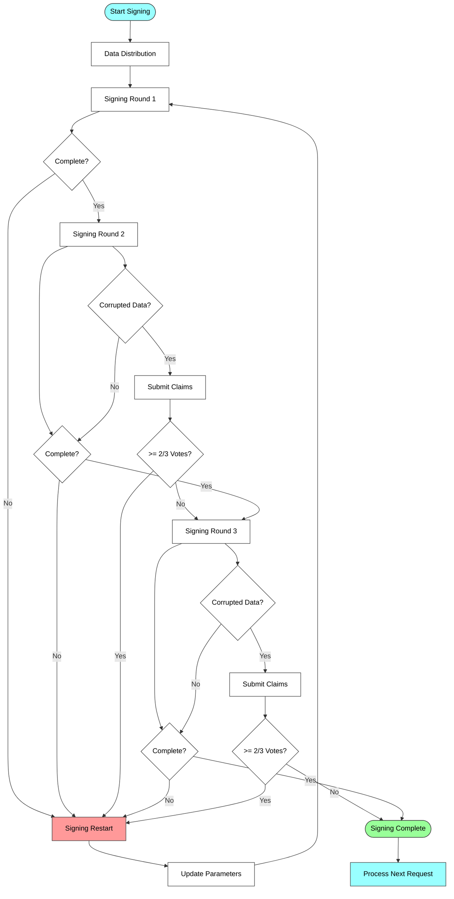

## 4. Implementation of the DKG and Signing

This section describes the practical implementation of the Distributed Key Generation (DKG) and Transaction Signing processes using the FROST library for Bitcoin transactions.
The Coordinator serves as the central place for both the DKG and Signing processes, managing global state, communication between participants. The implementation uses the secp256k1 elliptic curve, which is the same curve used in Bitcoin's cryptographic operations.

### 4.1 DKG Data Structures

The DKG process utilizes a hierarchical data structure that tracks the state and components of the distributed key generation protocol:

#### Main DKG Structure

- **State**: Tracks the current phase of the DKG process (Finished, InProgress, Part1Finished, or Part2Finished)
- **VSet**: Set of validators participating in the DKG process, mapped by ValidatorID [0..99] which is the same ID used for OracleID. Each element contains the public key of the participant (validator key in case of production mode and oracle hard-coded key in standalone mode)
- **MaxSigners**: Maximum number of signers allowed in the process. The Minimum number of Signers is calculated as 2/3 of the maximum number of signers.
- **VSetMask**: Bit mask indicating which validators are active in the DKG process. In this mask, each bit position corresponds to the OracleID (e.g., bit position 5 represents Oracle with ID 5). There is a "claim" process which allows Oracles to vote for another oracle's eviction from DKG in case of malicious actions. Additionally, in case of timeouts, the Coordinator can automatically evict Oracles from the DKG process.
- **SessionKeys**: Public keys generated by validators during the final part of DKG (Round 3) and used to sign messages for the Coordinator during the Signing process. These should not be confused with the FROST distributed key that signs the actual pegout transactions.
- **Round Data**: Structures for each of the three DKG rounds (R1, R2, R3)

  - **Round 1 Data**:

    - **Mask**: Bit mask tracking which validators have submitted their R1 data
    - **Count**: Number of submissions received for Round 1
    - **Packages**: Collection of cryptographic packages from each participant mapped by validator ID. These are FROST-specific packages containing commitment data.

  - **Round 2 Data**:

    - **Mask**: Bit mask tracking which validators have submitted their R2 data
    - **Count**: Number of submissions received for Round 2
    - **PackagesTo**: Two-level mapping of packages from sender to recipient validators (PackagesTo[FromId][ToId]). These are FROST-specific packages where each Oracle generates a unique package for every other Oracle.

  - **Round 3 Data**:
    - **Mask**: Bit mask tracking which validators have submitted their R3 data
    - **Count**: Number of submissions received for Round 3
    - **PubkeyData**: Contains the distributed public key package and internal key data for verification. These are FROST-specific packages.

- **Claims**: Data about validator claims during the DKG process. It contains:
  - **Mask**: Bit mask indicating Oracles who have submitted claims
  - **Count**: Total number of claims received
  - **Counters**: Mapping of Oracle IDs to their respective claim counts
- **Configuration Hash**: Hash of the system configuration
- **Attempts**: Counter for the number of DKG attempts made
- **Until**: Timestamp indicating when the DKG process must complete. If the DKG is not completed before this timestamp, the Coordinator will not accept any DKG messages except those restarting the DKG process

### 4.2 Signing Data Structures

The Signing process uses data structures that connect to artifacts produced during the DKG process. The primary connection is the secret from DKG Round 3, which is stored as a file in the `secrets` folder, with the filename matching the DKG public key.

The core data structure for the signing process is the `PegoutRecord`, which tracks all information related to a transaction waiting to be signed:

- **ID**: Unique identifier for the pegout record
- **PegoutAddress**: TON blockchain address information, which includes:

  - **Address Type**: Can be NoneAddress (0), ExtAddress (1), StdAddress (2), or VarAddress (3)
  - **Workchain**: The TON blockchain workchain ID (with Masterchain having a special value of -1)
  - **Flags**: Configuration flags (bounceable, testnet)
  - **Bit Length**: Size of the address data in bits
  - **Address Data**: The actual address data as a byte array

- **InternalKey**: Internal key data required for signing
- **Commitments**: Mapping of Oracle IDs to their FROST commitments for this pegout
- **CommitmentsMask**: Byte array tracking which Oracles have submitted commitments
- **SigningShares**: Two-level mapping of signing shares from sender Oracles to recipient Oracles
- **SigningSharesMask**: Byte array tracking which Oracles have submitted signing shares
- **Signatures**: Structure containing the completed signature data:
  - **Mask**: Bit mask of Oracles who contributed to the signature
  - **Count**: Number of signature components
  - **Hash**: Hash of the signature data
- **ClaimsMask**: Bit mask indicating which Oracles have submitted claims
- **ClaimsCount**: Total number of claims received
- **ClaimsCounters**: Mapping of Oracle IDs to their respective claim counts
- **MaxSigners**: Maximum number of signers allowed for this pegout
- **ExpiredAt**: Timestamp indicating when this pegout record expires
- **SigningMask**: Bit mask indicating which Oracles are participating in signing

### 4.3 System Workflows

Oracle instances operate in a stateless manner, with periodic timer events triggering the beginning of processes. Each time an event fires, the Oracle goes through all steps from the beginning of the workflow.

The system supports two operational modes:

**Standalone Mode**:

- Designed for test environments
- Uses "hardcoded" keys in the configuration for message signing
- Coordinator contract must be deployed with pre-configured VSet for specific Oracles and their associated keys
- No Validator is required in this mode

**Production Mode**:

- Designed for production environments
- Oracle must have access to validator-console to make signing requests
- Coordinator contract must be deployed with production settings
- VSet in this mode is obtained from config 36

**NOTE**: Every message in the DKG process includes an Oracle signature - obtained through validator-console in production mode or using the hardcoded key in standalone mode.

### 4.4 DKG Process

The goal of the DKG process is to generate a cryptographic key distributed across all participating Oracles. No single Oracle has access to the complete key.

**Step 1: Get DKG Data from Coordinator**

- A timer event fires every N seconds
- Oracle calls the `get_dkg` method from the Coordinator (getter)
- On success: Coordinator returns the current DKG structure
- On failure: Oracle pauses the DKG process for N seconds

**Step 2: Check if DKG is Complete**

- If DKG State is `DKGStateFinished`, then the DKG process is done
- Oracle will pause DKG for N seconds
- If DKG is not finished, proceed to Step 3

**Step 3: Check DKG Timeout**

- Verify that the DKG has not timed out by checking that the `until` value is after the current timestamp
- If DKG is not timed out, proceed to Step 4
- If DKG is timed out, Oracle resets its DKG State:
  - Generate new Session key and save it to a file (filename matches the `until` value)
  - Clean all artifacts
  - Save Coordinator's `until` DKG value to the Oracle's `until` DKG value
  - Pause DKG for N seconds

**Step 4: Get Key Information**

- Iterate over all VSet records to find a match with the public keys Oracle has
  - In production mode: Validator key
  - In standalone mode: Key hardcoded in config
- If no match is found, pause DKG for N seconds
- If match is found, continue to Step 5

**Step 5: Check for Eviction**

- Check VSetMask to determine if the Oracle has been evicted
- If Oracle is evicted, pause DKG for N seconds
- If Oracle is not evicted, continue to Step 6
  Eviction status is checked on the Coordinator side. On the Oracle side, this check is only used for logging and timeout cases.

**Step 6: DKG Round 1**
We assume that DKG initial state setup as described in 3.1. Distributed Key Generation (DKG).

- Check if DKG is at Round 1 state (`DKGStateInProgress`)
  - If not, proceed to Step 7 (DKG Round 2)
- Check if Oracle already sent DKG Round 1 package and is waiting for others:
  - Check in Coordinator's DKG data
  - Check in local artifacts (in case transaction was sent but not yet processed)
  - If already sent, pause DKG for N seconds
- If not already sent:
  - Generate new Round 1 data (commitment and secret share) as described in 3.1. Distributed Key Generation (DKG).
  - Save secret share to Oracle artifacts
  - Send commitment to Coordinator (OpCode: `0x0000eaea`)
  - Pause DKG for N seconds

**Step 7: DKG Round 2**

- Check if DKG is at Round 2 state (`DKGStatePart1Finished`)
  - If not, proceed to Step 8 (DKG Round 3)
- Check if Oracle already sent DKG Round 2 packages and is waiting for others
  - If already sent, pause DKG for N seconds
- If not already sent:
  - Generate new Round 2 data (individual shares for each other Oracle) as described in 3.1. Distributed Key Generation (DKG).
  - Save secret to Oracle artifacts
  - Send Round 2 packages to Coordinator (OpCode: `0x0000bb50`)
  - Pause DKG for N seconds

**NOTE**: In Round 2, FROST may detect a "culprit" Oracle that sent corrupted Round 1 package. FROST can detect one culprit at a time. If a culprit is detected, Oracle sends a claim message to the Coordinator (OpCode: `0x0000f387`). If at least 2/3 of DKG participants claim an Oracle, it will be evicted from this DKG round and the DKG must be restarted.

**Step 8: DKG Round 3**

- Check if DKG is at Round 3 state (`DKGStatePart2Finished`)
  - If not, proceed to Step 9 (DKG Finished)
- Check if Oracle already sent DKG Round 3 packages and is waiting for others
  - If already sent, pause DKG for N seconds
- If not already sent:
  - Generate new Round 3 data (Key package, public key package) as described in 3.1. Distributed Key Generation (DKG).
  - Save key package to Oracle keystore
  - Send Round 3 public key to Coordinator
  - Pause DKG for N seconds

**NOTE**: Similar to Round 2, FROST may detect a "culprit" Oracle that sent corrupted Round 2 packages. If a culprit is detected, Oracle sends a claim message to the Coordinator. If at least 2/3 of DKG participants claim an Oracle, it will be evicted and DKG must be restarted.

**Step 9: DKG Finished**

- After completing all rounds, the Coordinator's DKG data contains:
  - The distributed public key
  - The set of Oracles who can participate in pegout signing

**DKG Process State Diagram**

The following diagram illustrates the state transitions in the DKG process:

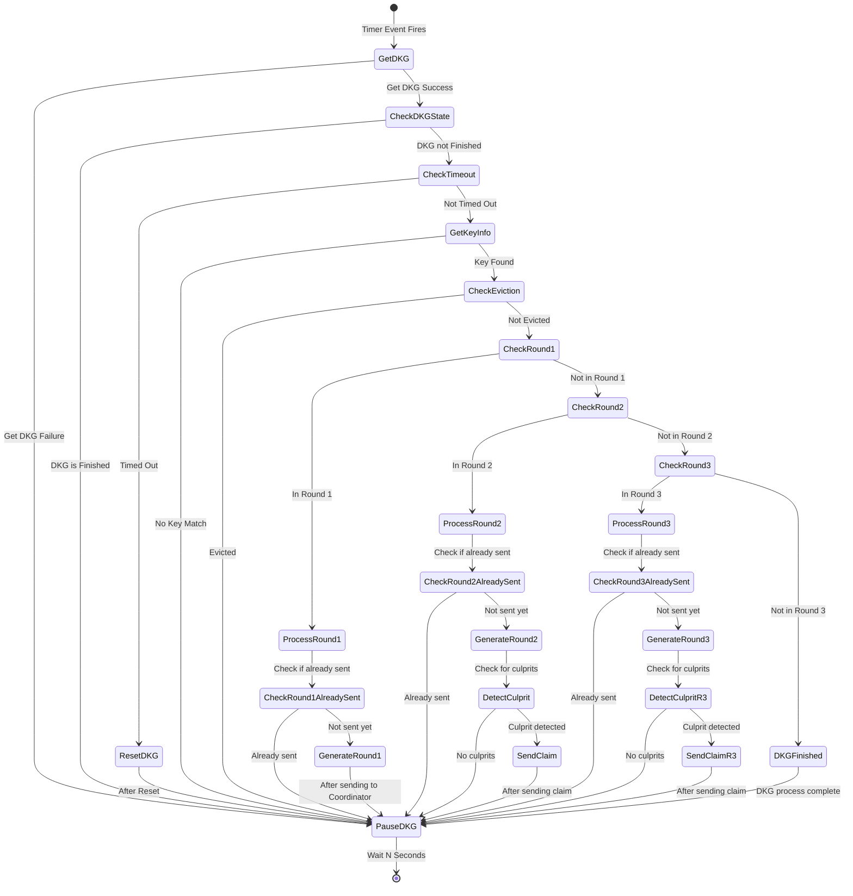

### 4.5 Signing Process

The signing process enables Oracles to collectively sign Bitcoin transactions (pegouts) using the distributed key generated during the DKG process. The system operates in epochs, with each epoch having its own set of validators.

#### 4.5.1 Epochs and DKG Coordination

Life cycle of Oracles is separated into epochs. In each epoch there is a different set of validators (sets can intersect or be the same). When the next validator set becomes known, a new DKG must be initiated for the next epoch. This leads to two DKGs existing simultaneously:

1. **New DKG**: Will be used for signing in the next epoch
2. **Current DKG**: Used for signing in the current epoch

If the system is just starting and there is no current DKG, signing will only be available from the next epoch onwards.

#### 4.5.2 Signing Workflow

The signing procedure is used for Bitcoin transactions (pegouts). The Coordinator maintains a list of unsigned pegouts, and Oracles periodically check this list to initiate the signing process when needed.

**Step 1: Check for Unsigned Pegouts**

- A timer event fires every N seconds
- Oracle calls the `get_pegout_records` method from the Coordinator (getter)
- On success: Coordinator returns list of unsigned pegouts
  - If list is not empty, proceed to Step 2
  - If list is empty, pause Signing for N seconds
- On failure: Oracle pauses the Signing process for N seconds

**Step 2: Load Session Signer**

- Oracle loads the session signer from the file system
  - File name will be equal to the `dkg.Until` value
- On success: Session signer contains private key for message signing
  - Proceed to Step 3
- On failure: Oracle pauses the Signing process for N seconds

**Step 3: Select Pegout**

- Get oldest pegout (first element from the pegouts list)
- Proceed to Step 4

**Step 4: Check for Eviction**

- Check SignMask to determine if the Oracle has been evicted
- If Oracle is evicted, pause Signing for N seconds
- If Oracle is not evicted, continue to Step 5
- _Note_: Eviction status is checked on the Coordinator side. On the Oracle side, this check is only used for logging and timeout cases

**Step 5: Check for Signing Restart**

- The Coordinator works in passive mode and requires external messages to trigger actions
- Oracle checks for Signing timeout condition
- If timeout condition is met:
  - Oracle sends Restart Signing message (OpCodeCoordinatorResetPegoutSigning = 0xe6c20000)
  - Oracle pauses the Signing process for N seconds
- If timeout condition is NOT met, proceed to Step 6

**Step 6: Get Pegout Data**

- Oracle stores current signing pegout data between steps
- If there is no cached pegout data in Oracle artifacts:
  - Data is requested from Pegout Contract identified by Pegout Address
  - Contract returns: txParts, txInputs, signingHashes
  - This data is cached in Oracle artifacts
- If there is cached pegout data in Oracle artifacts, use this data
- Proceed to Step 7

**Step 7: Calculate Minimum Signers**

- Calculate min_signers value as 2/3 of all Oracles from DKG
- Proceed to Step 8

**Step 8: Round 1 - Generate Signing Commitment**

- Check if commitment has already been generated and sent to the Oracle
  - If so, proceed to Step 9
- Check if commitments count >= min_signers (value contained in pegout info from Coordinator)
  - If condition is met, required number of signatures has been collected
  - Oracle pauses the Signing process for N seconds
- Try to load nonces and commitments from keystore
  - If not found, generate new ones with FROST and save to file
  - To generate new data, use Secret package from DKG Round 3
- Send commitments to the Coordinator (OpCodeCoordinatorSendCommitments = 0x58e40000)
- Oracle pauses the Signing process for N seconds

**Step 9: Round 2 - Aggregate Sign Shares**

- Get commitment packages from Pegout artifacts
  - If no commitments found, Oracle pauses the Signing process for N seconds
- Check if sign shares have already been generated and sent to the Oracle
  - If so, proceed to Step 10
- Check if signing shares count >= min_signers (value contained in pegout info from Coordinator)
  - If condition is met, required number of shares has been collected
  - Oracle pauses the Signing process for N seconds
- For each pegout input, generate signature using:
  - Secret package from DKG Round 3
  - Signing hash for current input
  - Commitments
  - Nonces
  - Tap merkle root (used as tweak for tweaking signing share)
- If corrupted data is detected:
  - Send special `claim` message to the Coordinator identifying the `culprit` Oracle
  - If at least 2/3 of current Oracles vote for eviction, the culprit is added to the eviction list
  - Signing process is restarted
- Aggregate all sign shares for all inputs
- Store sign shares for all inputs in keystore
- Send sign shares to the Coordinator (OpCodeCoordinatorSendSigningShare = 0x706b0000)
- Oracle pauses the Signing process for N seconds

**Step 10: Signature Aggregation**

- Each Oracle retrieves:
  - Signing Shares from other Oracles
  - Commitment packages
  - Public key
  - Tap tweak
- From this data, aggregate signature for each pegout input (using pegout input hash and merkle root)
- If corrupted data is detected:
  - Send special `claim` message to the Coordinator identifying the culprit Oracle
  - If at least 2/3 of current Oracles vote for eviction, the culprit is added to the eviction list
  - Signing process is restarted
- Aggregate all signatures for all inputs and send to the Coordinator (OpCodeCoordinatorSendSignature = 0xd0720000)
- The signing procedure is now complete
- Oracle pauses the Signing process for N seconds

**Signature Done**
When signature for a specific pegout ID is complete, the Coordinator has the signature for this pegout and the transaction can be published to the Bitcoin network.

#### 4.5.3 Restarting Signing

When Signing is restarted:

1. Number of Oracles (max_signers): Value updated with respect to the list of Oracles who were evicted
2. Threshold value (min_signers): Remains the same
3. Time period for Signing: Remains the same
4. List of Oracles: Oracles who were evicted are removed from this list
5. List of evicted Oracles: Remains the same

#### 4.5.4 Signing Process State Diagram

The following diagram illustrates the state transitions in the Signing process:

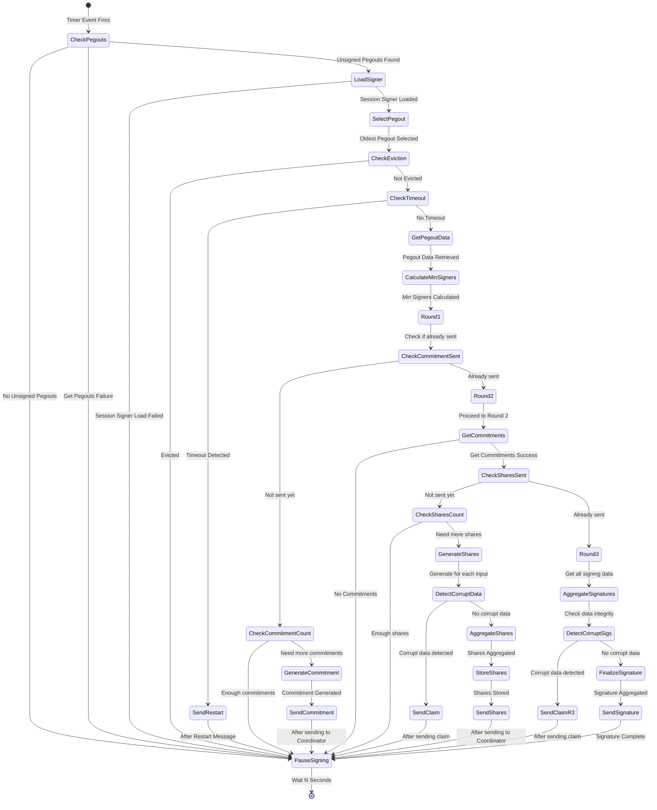

[^1]: https://github.com/ZcashFoundation/frost
